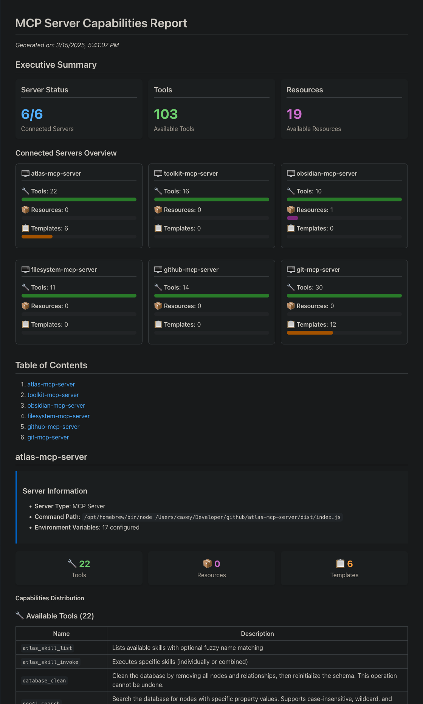

# MCP Reporter

[](https://www.typescriptlang.org/)
[](https://modelcontextprotocol.io/)
[]()
[](https://opensource.org/licenses/Apache-2.0)
[]()
[](https://github.com/cyanheads/mcp-reporter)

MCP Reporter is a utility for generating comprehensive reports about Model Context Protocol (MCP) server capabilities, helping developers understand what functionality is available across their MCP server ecosystem. Can also be used programmatically to generate reports for documentation or for feeding into other tools.

## Table of Contents

- [Features](#features)
- [Installation](#installation)
- [Configuration](#configuration)
- [Usage](#usage)
- [Report Structure](#report-structure)
- [Project Structure](#project-structure)
- [Example Report](#example-report)
- [Development](#development)
- [License](#license)
- [Author](#author)

## Features

- **Server Discovery**: Automatically connects to all enabled MCP servers
- **Capability Analysis**: Extracts tools, resources, and resource templates
- **Markdown Report Generation**: Produces well-organized documentation
- **Progress Monitoring**: Provides real-time feedback during execution

# Image Preview of Generated Report (Partial)



## Installation

### Prerequisites

- Node.js 16.x or higher
- npm or yarn

### Install from Source

```bash
# Clone the repository
git clone https://github.com/cyanheads/mcp-reporter.git
cd mcp-reporter

# Install dependencies
npm install

# Build the project
npm run build

# Create a symlink (optional)
npm link
```

## Configuration

MCP Reporter requires a configuration file that defines the MCP servers you want to analyze:

```bash
# Create a configuration file from the example
cp mcp-servers.json.example mcp-servers.json
```

Example configuration:

```json
{
  "mcpServers": {
    "atlas-mcp-server": {
      "command": "/path/to/node",
      "args": ["/path/to/atlas-mcp-server/dist/index.js"],
      "env": {
        "NEO4J_URI": "bolt://localhost:7687",
        "NEO4J_USER": "neo4j",
        "NEO4J_PASSWORD": "your-password-here"
      }
    },
    "another-server": {
      "command": "/path/to/node",
      "args": ["/path/to/another-server.js"],
      "env": {}
    }
  }
}
```

## Usage

### Command Line Interface

```bash
mcp-reporter [options]
```

| Option                | Description                | Default                       |
| --------------------- | -------------------------- | ----------------------------- |
| `-c, --config <path>` | Path to MCP servers config | `mcp-servers.json`            |
| `-o, --output <path>` | Output path for report     | `output/mcp_server_report.md` |
| `-s, --schemas`       | Include input schemas      | `true`                        |
| `-m, --metadata`      | Include server metadata    | `true`                        |
| `-e, --examples`      | Include examples           | `true`                        |

### Examples

You can run mcp-reporter either via 'npm run start' or by using the symlink (optional) created during installation:

```bash
# Generate a report with default settings
npm run start

# Generate a report using symlink
mcp-reporter
```

### Programmatic Usage

```javascript
import { McpReporter } from "mcp-reporter";

async function generateReport() {
  const reporter = new McpReporter("./my-config.json", {
    outputPath: "./reports/mcp-report.md",
    includeInputSchemas: true,
    includeServerMetadata: true,
  });

  await reporter.run();
}

generateReport().catch(console.error);
```

## Report Structure

The generated markdown report includes:

1. Summary of all MCP servers analyzed
2. For each server:
   - Server metadata
   - Available tools with descriptions and input schemas
   - Available resources with URIs and descriptions
   - Available resource templates with URI templates

## Project Structure

```
mcp-reporter/
├── src/               # Source code
│   ├── cli.ts         # Command line interface
│   ├── index.ts       # Main library code
│   ├── types/         # TypeScript type definitions
│   └── utils/         # Utility functions
├── scripts/           # Build and maintenance scripts
├── docs/              # Documentation
├── output/            # Default output directory for reports
└── mcp-servers.json   # Server configuration (create from example)
```

## Development

```bash
# Clean build artifacts
npm run clean

# Rebuild the project
npm run rebuild

# Generate project structure visualization
npm run tree
```

## License

This project is licensed under the Apache 2.0 License - see the LICENSE file for details.

## Author

Casey Hand (@cyanheads)
